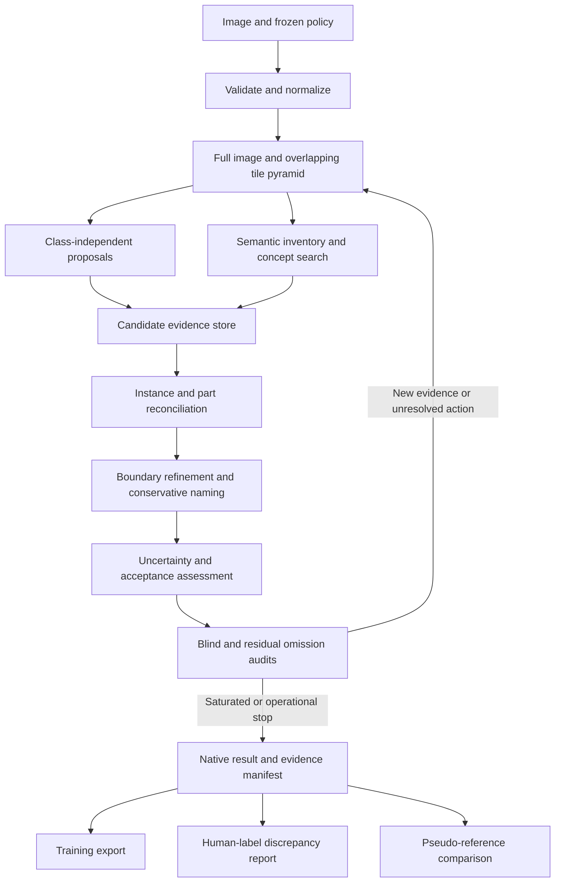

# Architecture and implementation boundaries

Contract coverage: CAP-1 through CAP-10. This companion records proposed implementation decisions derived from the discussion; exact model checkpoints and dependency versions are selected at M0.

## System flow



## Components

| Component | Responsibility | Required boundary |
|---|---|---|
| Input normalizer | Decode, orient, record conversion and coordinate transform | Never silently select a frame or rescale the stored reference image |
| Scan planner | Schedule full-frame, tiles, overlap, scale, and targeted revisits | Maintain planned/completed jobs and geometric coverage |
| Model workers | Generate regions, text hypotheses, masks, and verification evidence | Typed requests/results; no worker directly declares a final annotation |
| Evidence store | Preserve candidates, derivation lineage, transformations, failures | Immutable records with stable IDs and content hashes |
| Instance resolver | Reconcile repeated detections, overlapping instances, parts, and groups | Use geometry, appearance, semantics, context; avoid class-agnostic box suppression |
| Label resolver | Normalize synonyms, compare alternatives, select broader supported class | Validate against the frozen ontology; retain unknowns |
| Assessor | Apply policy and evidence rules; assign uncertainty and disposition | Keep model scores separate from calibrated correctness estimates |
| Search controller | Select next actions and apply deterministic stopping rules | Log every action, reason, skipped action, and termination condition |
| Exporters/evaluator | Produce use-specific views and measured reports | Native JSON remains authoritative; no silent loss of uncertainty |

Proposed packaging: Python 3.11+, typed data models, PyTorch-compatible adapters, local JSON/JSONL and mask artifacts, and SQLite for resumable job metadata.

### Changing a pinned dependency invalidates the numbers taken under the old one

A pin is part of the qualification identity, so moving it is a measured event rather than
housekeeping. It was measured here: on one panel image with an identical normalized-pixel hash and
every other input unchanged, two versions of the same inference library retained 394 and 382
objects with **no box identical between them**. Nothing survived the move unmoved.

A dependency change therefore carries three obligations, and all three apply before any figure
taken under the old pin is cited again. Every affected bundle manifest is re-issued for the new
version and re-verified, since preflight refuses a manifest whose declared version no longer
matches what imports. Every measurement that informed a decision is re-run, because a baseline,
an ablation and a gain measured on different geometry are not comparable to each other. And
results carried over from the old pin are marked as superseded rather than quietly reused.

The alternative to paying that cost is running the affected stage in a separate process against
its own bundle, which buys the old numbers' validity at the price of two dependency sets. Either
choice is legitimate; taking neither and reusing the numbers is not. Workers may use isolated environments to avoid incompatible model dependencies. No web server, cloud queue, or external database is required. Pin tested interpreter, CUDA/runtime, framework, tokenizer, and model versions in the shipped bundle rather than inventing versions in the spec.

## Candidate model roles

| Role | Candidate | What must be proven in M0 |
|---|---|---|
| Semantic inventory and crop interpretation | Qwen3-VL | Local loading, crop handling, typed output, hallucination behavior, resource fit |
| Primary class-independent proposals | WeDetect-Uni / WeDetect-Anything | Local ONNX or PyTorch execution, raw proposal recall, cap visibility, coordinate behavior, vocabulary separation, and GPL-v3 distribution compatibility |
| Prompted and alternate objectness evidence | OWLv2 | Direct query-independent objectness plus prompted detection, proposal-cap visibility, coordinate behavior |
| Text/exemplar concept search and prompted segmentation | SAM 3 | Required checkpoint interfaces, point/box/text support, full local execution |
| Boundary refinement | SAM 3 (`Sam3TrackerModel` box-prompt path) | Gated-licence terms readable into the bundle manifest, the `transformers` bump staged separately, and a measured trade at the thresholds the gates actually use rather than at IoU 0.50 alone |
| Retained-set pruning | TTN (Turing Test Network, Voxel51) | Local execution from staged weights, licence terms, selectivity against a model-score baseline, and behaviour by object size; it scores with CLIP ViT-L-14, which shares ancestry with an OWLv2 image tower and must be recorded as such |
| Verification diversity | Grounding DINO or another independently validated family | Incremental error reduction and ancestry disclosure, not merely extra votes |

References: [Qwen3-VL](https://github.com/QwenLM/Qwen3-VL), [WeDetect](https://github.com/WeChatCV/WeDetect), [OWLv2](https://github.com/google-research/scenic/tree/main/scenic/projects/owl_vit), [SAM 3](https://github.com/facebookresearch/sam3), [Grounding DINO](https://github.com/IDEA-Research/GroundingDINO). These document available building blocks, not the performance of this proposed pipeline. Availability of an API/demo is insufficient; deployment requires locally runnable weights under suitable terms. Published WeDetect and OWLv2 metrics are not directly comparable; the selection protocol is recorded in [the model-selection note](../../../docs/model-selection.md).

### Routes, not weights

The discovery algorithm below is organised into routes: class-independent proposals, semantic inventory, concept and exemplar search. Two models on the same route tend to miss the same objects, so adding one buys less recall than its benchmark position suggests and costs precision immediately, since every added box enters the retained set while only some enter the matched set.

A second prompted text-conditioned detector is therefore not a new route, whatever its published numbers. Route diversity is the reason D22 prefers a candidate that separates prompt-free visual proposals from vocabulary retrieval. Before any route is added to close a recall gap, miss attribution under [evaluation.md](evaluation.md) must show that the missing objects were never proposed at any score in any view; a ranking, merge or boundary defect is repaired where it occurs.

Proposal caps are a route property that interacts with scene density. A route decoding a fixed number of queries per forward can saturate on a crowded view and lose objects silently; a route emitting one prediction per patch token above a score threshold cannot. Record the cap for every route and treat saturation as incomplete search.

### Prompt vocabulary is per-model configuration, versioned apart from the ontology

A concept-promptable model is driven by noun phrases, and its behaviour changes with the phrasing:
an ontology ID is an identifier chosen for the schema, not a prompt chosen for a model. Feeding
class IDs in directly is the prompt anchoring the naming rules already warn about, and it silently
makes the ontology's spelling a model hyperparameter.

The phrasing is also not shared between models. A CLIP-style text tower, a presence head and a
phrase grounder do not respond alike, and the wording that finds a small overhead figure for one
may find nothing for another. A single vocabulary would therefore be wrong for every model except
the one it was tuned on.

So a vocabulary is a separate versioned artifact, one per model family, declaring the ontology and
version it maps from, the adapter it is for, and a phrasing for each class it covers. It is not a
field on the ontology. Keeping them apart is what stops a prompt recalibration from bumping the
taxonomy's version and invalidating qualification results that have nothing to do with taxonomy,
and it is what lets two models be asked the same question each in its own language.

A class the vocabulary does not cover falls back to the ontology's canonical name, and the run
records that it did, so an uncalibrated class is visible rather than silent.

Every run records which vocabulary each adapter used, by ID, version and hash, and the vocabulary
is bound into the qualification identity like any other frozen configuration. Changing it changes
results and requires a new qualification. Selecting it is dataset-level prompt optimization, so it
is fitted only on a development or calibration split and frozen before the locked evaluation is
opened; a vocabulary tuned on the evaluation panel invalidates that panel.

Cross-model comparison uses each model's own vocabulary rather than a common one, because the
question being asked is whether the models agree about the world, not whether they respond alike to
one string. What must travel with such a comparison is which vocabulary each side used.

Boundary refinement prompts one box at a time and has no class loop, so it sits on the visual-prompt
path rather than the concept path, and the multi-class backbone sharing that accelerates concept
detection does not apply to it. Refinement runs inside overlapping source-resolution tiles, one
model pass serving every box in a tile: a whole-frame pass delivers a small object at a fraction of
its pixels after the processor's resize, and a per-box crop pays a full encoder pass to upscale a
window that carries no more information than the tile did.

Dense point-prompted segmentation may use a separate SAM-family adapter if the selected concept model does not expose an adequate automatic-proposal path. Evaluate the adapter against the same interfaces. Model selection is replaceable without altering the annotation contract.

## Discovery and reconciliation algorithm

1. Run a full-image pass for global context and large objects. Build a deterministic overlapping crop pyramid that prevents native-resolution details from disappearing through whole-image downsampling. M0 fixes crop sizes and overlap against actual encoder limits.
2. For each scheduled view, generate class-independent objectness/mask proposals and an unprompted semantic inventory. WeDetect-Uni / WeDetect-Anything is the primary proposal candidate and direct OWLv2 objectness is the alternate source; select or union them only after the frozen same-data comparison. Search inventory terms, synonyms, broad ontology terms, and exemplars; inventory omission cannot block class-independent discovery.
3. Keep low-threshold candidates with provenance. Record top-k caps and any suspected saturation of model output capacity; increase caps, divide the view, or mark the route incomplete rather than silently losing candidates.
4. Map candidates to original coordinates and build an evidence graph. Edges distinguish same-instance hypotheses, part relations, mutually exclusive interpretations, and spatial overlap.
5. Deduplicate only after evaluating instance identity. Recheck crop boundaries on expanded views; separate touching instances where evidence supports separation. Keep unresolved groups instead of fabricated counts.
6. Refine masks/boundaries on source-resolution crops. Compare the crop and surrounding scene for naming. Obtain descriptions before presenting candidate names to reduce prompt anchoring.
7. Verify alternatives with different views and, where useful, another model family. Retain single-route discoveries until assessed; consensus is neither a mandatory veto nor a correctness probability. Shared model ancestry remains visible.
8. Assess acceptance separately from search scheduling. A rejected hypothesis remains in evidence storage with a reason; a plausible unknown remains in native output.
9. Perform omission audits and repeat where useful. New semantic classes can cause a full-image instance search, without replacing the scheduled spatial audit.

Contrast and deterministic enlargement are search aids. Acceptance always checks original pixels and transformations. Generative super-resolution, inpainting, or synthetic detail cannot supply evidence. Residual inspection uses the original image alongside overlays; covered boxes cannot hide their contents from future search.

Image-derived concept queries and crop choices are permitted test-time search inputs under frozen rules. They do not update weights, shared prompts, ontology, or acceptance thresholds from target data. Initial input support is static JPEG/PNG with RGB or explicitly recorded grayscale/RGBA conversion; M0 freezes the alpha-compositing policy, and untested alpha handling remains unqualified.

## Search termination

The default exhaustive profile has no wall-clock target. Optional limits exist for operating a real machine, and exhaustion is an explicit partial outcome.

The single-pass baseline uses a separate `baseline` profile and reports `profile_complete` when its narrower schedule finishes. That status cannot be mapped to exhaustive saturation or inherit exhaustive-profile qualification.

Proposed saturation rule: mandatory full-frame and multiscale spatial routes have completed successfully, and three consecutive complete audit rounds add no retained instance and no material change to instance identity, supported class, boundary, or unresolved state. An audit round includes blind spatial rediscovery, residual examination inside and outside existing boxes, and eligible exemplar/disagreement tasks. Jobs may be inapplicable with a recorded reason; failed required jobs cannot be called inapplicable.

M0 freezes a saturation configuration containing tile grids, proposal thresholds/caps, prompt variants, material-change tolerances, and audit actions. Rejected repeated noise is not a new discovery; every reconsideration and rejection remains logged. Cycles and oscillating hypotheses cannot falsely advance the stable-round counter. An explicit cycle/resource stop emits partial results.

Search saturation is an operational property of that schedule. It is not a probability that no object remains unseen. A saturated image may still contain unresolved objects and may be unsuitable for a given export.

## Persistence, determinism, and offline operation

Persist stage boundaries atomically. Cache keys include normalized pixels, model/checkpoint, prompt, policy, ontology, config, transforms, and schema/adapter versions. Changing any dependency invalidates affected jobs. Batch execution does not update models, ontology, prompts, or thresholds from previous target images.

Record random seeds, numerical precision, hardware, nondeterministic kernels, elapsed time, peak memory, candidate counts, and model calls. The qualification manifest declares which same-platform reproducibility tolerances passed; do not promise cross-hardware bitwise identity. Threshold-adjacent results that change disposition across permitted reruns remain uncertain unless qualification demonstrates stability.

Before an annotation starts, verify local weights, tokenizer assets, licenses/access conditions, integrity hashes, and storage capacity. Runtime must not attempt downloads or telemetry. Validate offline behavior with the network denied. VLM responses are untrusted data: schema-check them, reject executable content, and ignore any instruction visible in image text that attempts to alter policy or invoke tools.

## Proposed command surface

These commands are delivery interfaces, not commands already implemented:

```text
lynceus doctor --bundle /models/bundle --offline
lynceus policy --ontology aerial-traffic-strict-v1
lynceus schema
lynceus annotate image.png --bundle /models/bundle --policy physical-entities-visible-v1 --profile exhaustive --output run/
lynceus resume run/
lynceus validate run/annotation.json
lynceus export run/ --use training --format coco --output export/
lynceus audit run/ --labels human-labels.json --mapping mapping.json --output audit/
lynceus compare run/ --predictions detector.json --mapping mapping.json --output comparison/
lynceus evaluate --benchmark benchmark-manifest.json --bundle /models/bundle --output qualification/
```

`policy` and `schema` print the frozen policy, the available ontologies, and the native JSON Schema. They read no image and load no model; they exist so that a consumer can obtain the contract a result will be validated against without executing a run.

Successful command completion is distinct from annotation qualification. Re-running a completed command must not overwrite immutable evidence without a new run identity.

### Exit codes

Stable across commands; a code is a machine-readable outcome class, never a quality statement.

| Code | Meaning |
|---|---|
| 0 | Success, including a validated result that retained no objects |
| 2 | Usage error or invalid/typed-rejected input |
| 3 | Partial output: execution completed, search stopped at a budget or resource limit |
| 4 | Failed or interrupted execution; completed evidence is retained |
| 5 | Missing, incomplete, or unverifiable model bundle; no run directory is created |
| 6 | Incompatible or unsafe export refused (reserved until WP-11) |

A nonzero code on `annotate` never leaves a fabricated annotation behind. Code 3 is the documented partial-result code referenced by [output-contract.md](output-contract.md).
